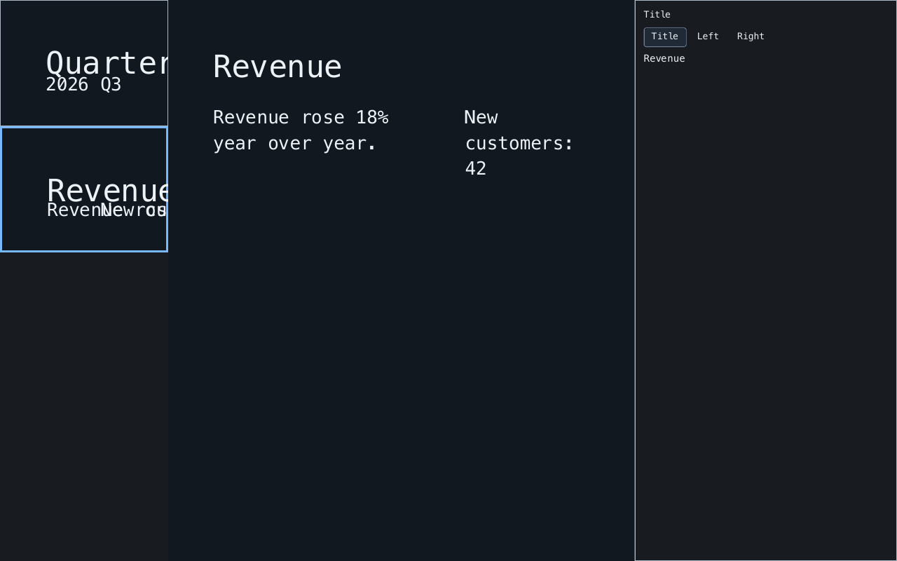

<h1 align="center">Hadar</h1>

<p align="center">
  <strong>Markdown-backed slide decks with source-preserving editing, live preview, and presentation export.</strong>
</p>

<p align="center">
  <a href="https://rubygems.org/gems/hadar"></a>
  <a href="https://rubygems.org/gems/hadar"></a>
  <a href="https://github.com/noxdea/hadar/actions/workflows/main.yml"></a>
  <a href="hadar.gemspec"></a>
  <a href="LICENSE.txt"></a>
</p>

<p align="center">
  <a href="https://noxdea.github.io/hadar/">Website</a> ·
  <a href="https://noxdea.github.io/hadar/docs/">User Guide</a> ·
  <a href="#features">Features</a> ·
  <a href="#installation">Installation</a> ·
  <a href="#quick-start">Quick start</a>
</p>

---

Hadar is a Ruby presentation library built around ordinary Markdown files.
[Beid](https://github.com/noxdea/beid) keeps the source-positioned document as
the editable copy; Hadar projects it into slides, slots, and a live
[Zaniah](https://github.com/noxdea/zaniah) preview. Embed a presentation window
in an app or export a deck without a GUI.

[](https://noxdea.github.io/hadar/docs/usage.html)

## Features

- Eight automatic or explicitly selected slide templates, plus opt-in freeform placement.
- Source-backed text, image, table-cell, and fenced-code editing with speaker notes.
- Three built-in JSONC themes (`minimal`, `dark`, `warm`) and custom themes.
- Virtualized slide thumbnails, keyboard navigation, a command palette, and a secondary-display presenter view.
- Searchable PDF, PNG-sequence, and animated PNG (APNG) export.

## Installation

Use **CRuby 3.2 or newer**. Install the gem, or add `gem "hadar"` to your
Gemfile and run `bundle install`:

```sh
gem install hadar
```

Hadar is a library; it does not install a `hadar` command. Windowed use
requires a [Zaniah-supported display backend](https://github.com/noxdea/zaniah#installation).
PNG and APNG export use Zaniah's headless renderer.

## Quick start

Save this as `slides.md`. The initial YAML front matter selects a theme;
later Markdown thematic breaks separate slides:

```markdown
---
theme: dark
---
# Quarterly report

## 2026 Q3

---

<!-- layout: two-column -->
# Revenue

::: left
Revenue rose 18% year over year.
:::

::: right
New customers: 42
:::
```

Save the following as `present.rb` beside the deck, then run `ruby present.rb`
(or `bundle exec ruby present.rb` in a Bundler project):

```ruby
require "hadar"

deck = Hadar::Deck.open(File.join(__dir__, "slides.md"))
app = Hadar::Application.new(deck)
window = Zaniah::Platform.open_window(title: "Hadar")
app.attach(main_window: window)
app.run
```

Select a thumbnail and a slot to edit. Arrow keys and Page Up/Down navigate
slides. **P** or **F5** toggles presentation, **F11** toggles fullscreen, and
**Escape** exits these modes. **Ctrl/Cmd-K** opens the command palette;
**Ctrl/Cmd-S** saves an opened deck. With a second display, Hadar opens a
presenter view with notes, the next slide, and elapsed time.

For headless export:

```ruby
require "hadar"

deck = Hadar::Deck.open("slides.md")
Hadar::Export::PDF.write(deck, "slides.pdf", font: "/path/to/font.ttf")
Hadar::Export::PNGSequence.write(deck, "slides-png", width: 1280, height: 720)
Hadar::Export::APNG.write(deck, "slides.apng", duration_ms: 2500)
```

Replace the PDF font path with a TrueType-outline font covering the deck's
text, or omit `font:` to use Zaniah's local font database. PDF embeds local
PNG/JPEG images and replaces an existing output file. PNG sequences refuse
existing frames; APNG requires `overwrite: true` to replace a file. See
[export](docs/export.md) for format options and limits.

## Editing and limits

Edits write back to Markdown through Beid. Opened decks save atomically and
refuse to overwrite external changes. Successful edits replace slot snapshots;
fetch the slot again before the next edit. The application reloads external
changes when there are no competing unsaved edits.

Rich-text edits support source-backed text runs, simple bold/italic changes,
and one-level list indentation. Structural changes and unsupported styles are
rejected. Tables and fenced code have dedicated editors. Image references
remain local paths; assets are not copied. Freeform positions are explicit
Markdown comments and lose their placement in a plain Markdown viewer. See
[editing and presenting](docs/usage.md) and [layouts](docs/layouts.md).

## Documentation

- [User Guide](https://noxdea.github.io/hadar/docs/) — installation and your first deck.
- [Editing and presenting](docs/usage.md) — slots, keyboard controls, save/reload, and notes.
- [Layouts and Markdown](docs/layouts.md) — templates, slide syntax, and freeform placement.
- [Themes](docs/themes.md) — built-in styles and custom JSONC themes.
- [Export](docs/export.md) — searchable PDF, PNG sequences, and APNG.
- [Development](docs/development.md) — tests, source structure, and website maintenance.
- [Changelog](CHANGELOG.md)

## Development

```sh
bundle install
bundle exec rake
```

Check the 100-slide thumbnail layout/scene-build budget with
`BUDGET=1 bundle exec ruby bench/slide_list.rb`. See the
[development guide](docs/development.md) for type checks and website previews,
and the [template-layout](docs/adr/001-template-layouts.md) and
[freeform-placement](docs/adr/002-opt-in-freeform-layout.md) decisions for the
source model.

## License

Hadar is released under the [MIT License](LICENSE.txt).
